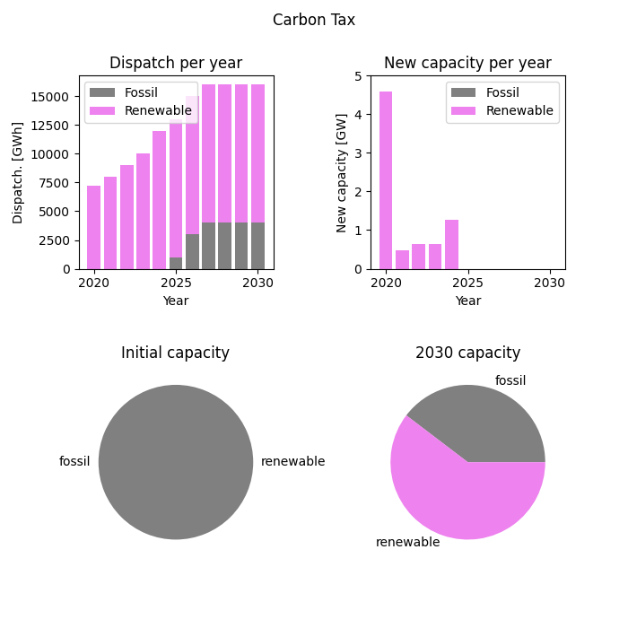
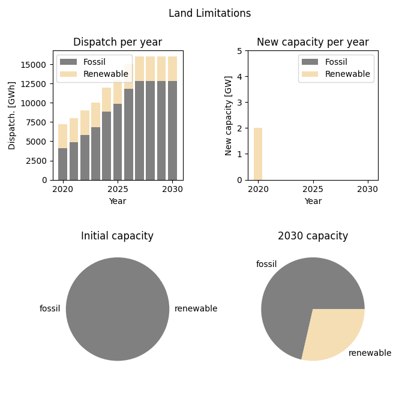
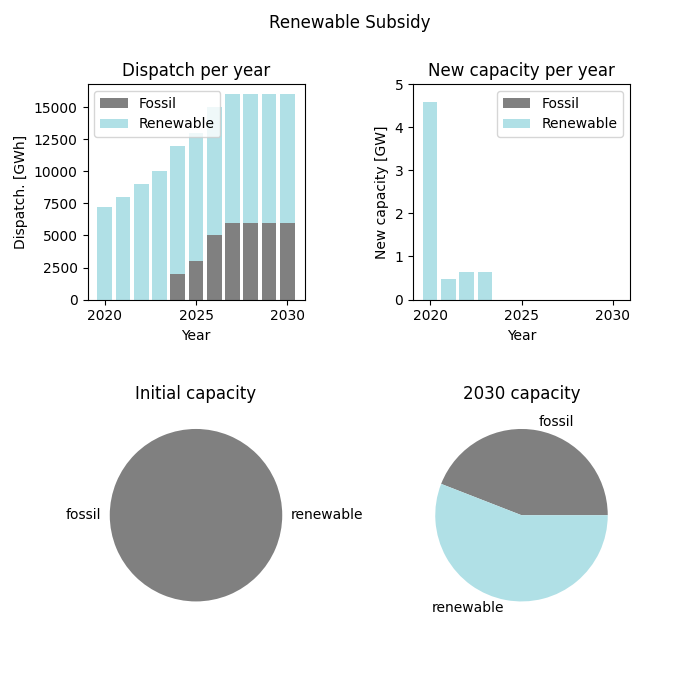

# Single Region Energy System Optimisation Project

## Project Overview

<ins>**Aim:**</ins> Determine the minimum cost power generation mix under different constraints 

<ins>**Objective:**</ins>  Implement a linear optimisation model of the electricity system of a single region

<ins>**Electricity generation technologies:**</ins> Fossil  |  Renewables 

<ins>**Scenarios:**</ins> Carbon tax  |  Renewables subsidy  |  Land limitation 

## Technical Skills
<ins>**Python libraries:</ins>** matplotlib  |  pandas  |  PuLP

<ins>**Skills:</ins>** Linear optimisation  |  Scenario modelling  |  Data visualisation

## Analysis
### Baseline scenario
Represents the electricity system with no intervention. 
Starting capacities: 
- Fossil: 5 GW
- Renewable: 0 GW

The evolution of installed capacity and dispatch is shown below: 

### Carbon tax

The evolution of installed capacity under a $45/tCO2 is shown below. The carbon tax enables the build out of more renewables. 

### Land limitation
A land limitation of 20km2 was applied. This limits the amount of renewables that can be installed, leading to lower capacities than the baseline. 

### Renewables subsidy
A renewables subsidy of 20% of CAPEX cost was applied. This encourages renewables similarly to a carbon tax, but results in slightly lower build rates. 

To achieve renewables build out under the carbon tax scenario, a higher percentage of CAPEX costs would need to be subsidised. 

